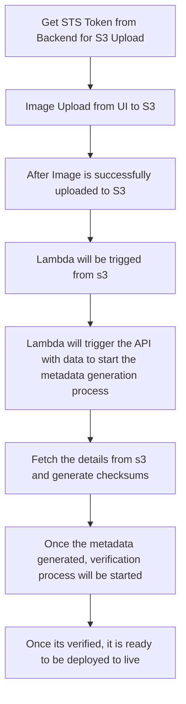

## Uptane image upload workflow

```mermaid
flowchart TD
    A[Get STS Token from Backend for S3 Upload] --> B[Image Upload from UI to S3]
    B --> C[After Image is successfully uploaded to S3]
    C --> D[Lambda will be trigged from s3]
    D --> E[Lambda will trigger the API with data to start the metadata generation process]
    E --> F[Fetch the details from s3 and generate checksums]
    F --> G[Once the metadata generated, verification process will be started]
    G --> H[Once its verified, it is ready to be deployed to live]
```
