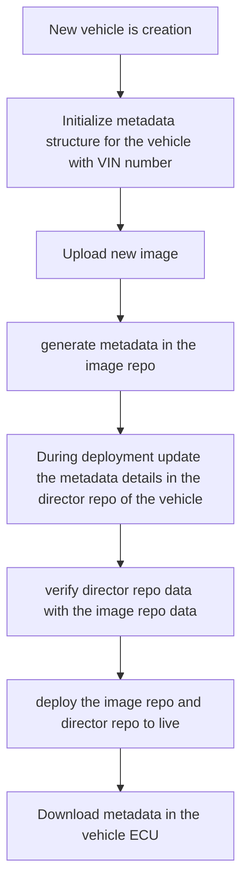
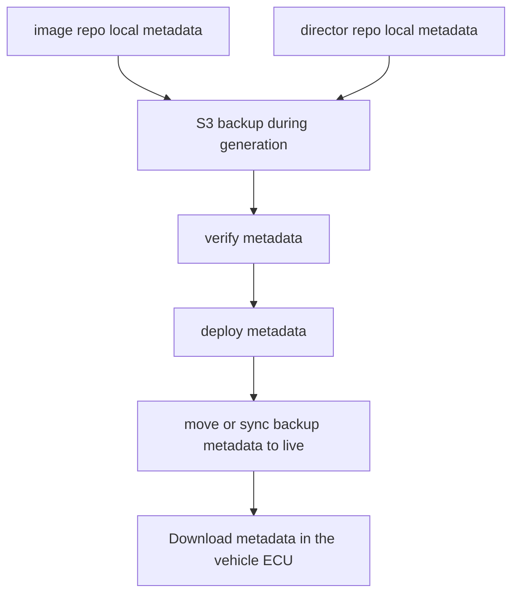

## Uptane image upload workflow

```mermaid
flowchart TD
    A[New vehicle is creation] --> B[Initialize metadata structure for the vehicle with VIN number]
    B --> C[Upload new image]
    C --> D[generate metadata in the image repo]
    D --> E[During deployment update the metadata details in the director repo of the vehicle]
    E --> F[verify director repo data with the image repo data]
    F --> G[deploy the image repo and director repo to live]
    G --> H[Download metadata in the vehicle ECU]
```
### Metadata backup

```mermaid
flowchart TD
    A[image repo local metadata] --> C[S3 backup during generation]
    B[director repo local metadata] --> C
    C --> D[verify metadata]
    D --> E[deploy metadata]
    E --> F[move or sync backup metadata to live]
    F --> G[Download metadata in the vehicle ECU]
```
