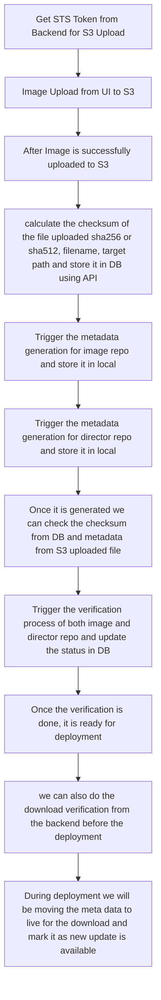

## Uptane image upload workflow

```mermaid
flowchart TD
    A[Get STS Token from Backend for S3 Upload] --> B[Image Upload from UI to S3]
    B --> C[After Image is successfully uploaded to S3]
    C --> D[calculate the checksum of the file uploaded sha256 or sha512, filename, target path and store it in DB using API]
    D --> E[Trigger the metadata generation for image repo and store it in local]
    E --> F[Trigger the metadata generation for director repo and store it in local]
    F --> G[Once it is generated we can check the checksum from DB and metadata from S3 uploaded file]
    G --> H[Trigger the verification process of both image and director repo and update the status in DB]
    H --> I[Once the verification is done, it is ready for deployment]
    I --> J[we can also do the download verification from the backend before the deployment]
    J --> K[During deployment we will be moving the meta data to live for the download and mark it as new update is available]
```
