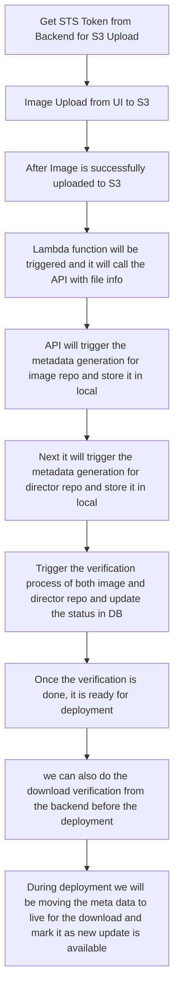

## Uptane image upload workflow

```mermaid
flowchart TD
    A[Get STS Token from Backend for S3 Upload] --> B[Image Upload from UI to S3]
    B --> C[After Image is successfully uploaded to S3]
    C --> D[Lambda function will be triggered and it will call the API with file info]
    D --> E[API will trigger the metadata generation for image repo and store it in local]
    E --> F[Next it will trigger the metadata generation for director repo and store it in local]
    F --> G[Trigger the verification process of both image and director repo and update the status in DB]
    G --> H[Once the verification is done, it is ready for deployment]
    H --> I[we can also do the download verification from the backend before the deployment]
    I --> J[During deployment we will be moving the meta data to live for the download and mark it as new update is available]
```
