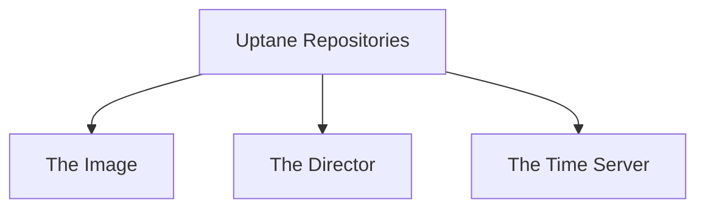
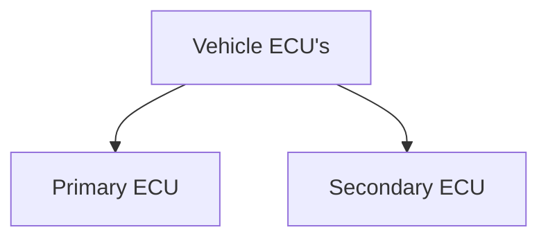
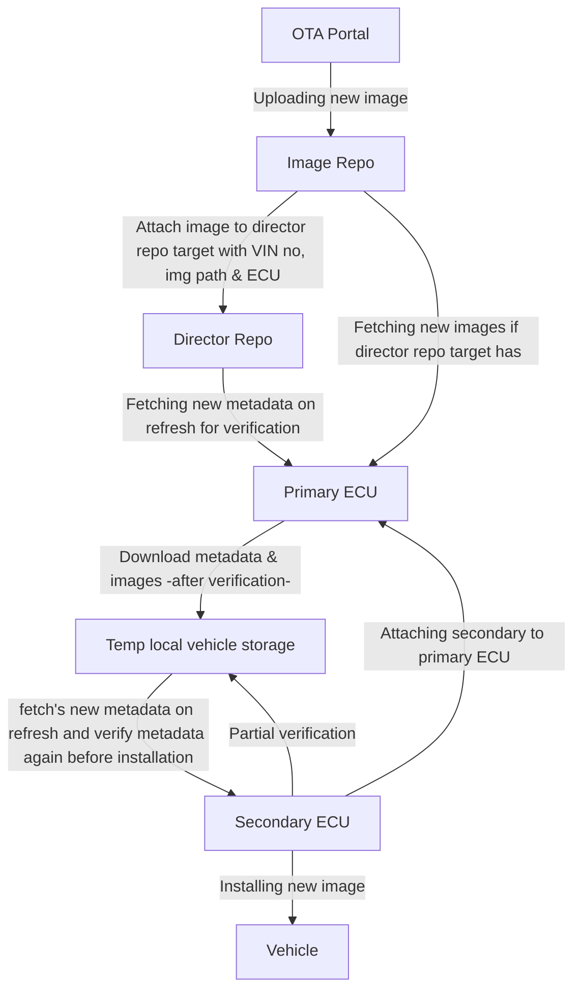

## Uptane Workflow

#### Repository workflow

```mermaid
graph TD
    A[Uptane Repositories] --> B[The Image]
    A -->C[The Director]
    A -->D[The Time Server]
```

#### ECU's Workflow

```mermaid
graph TD
    A[Vehicle ECU's] --> B[Primary ECU]
    A -->C[Secondary ECU]
```

#### Overall workflow

```mermaid
graph TD
    G[OTA Portal] --> |Uploading new image|C
    C --> |Attach image to director repo target with VIN no, img path & ECU|A
    A[Director Repo] -->|Fetching new metadata on refresh for verification| B
    C[Image Repo] -->|Fetching new images if director repo target has| B[Primary ECU]
    B --> |Download metadata & images -after verification-| D[Temp local vehicle storage]
    D --> |fetch's new metadata on refresh and verify metadata again before installation| E[Secondary ECU]
    E --> |Attaching secondary to primary ECU|B
    E --> |Partial verification|D
    E --> |Installing new image|F[Vehicle]
```
