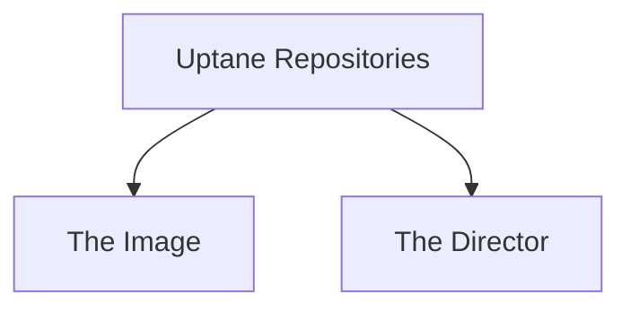
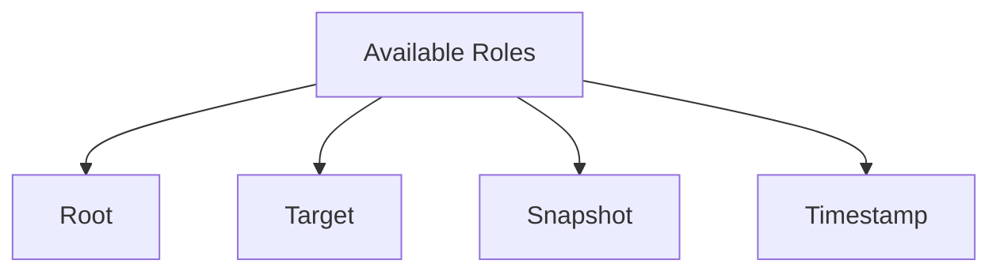
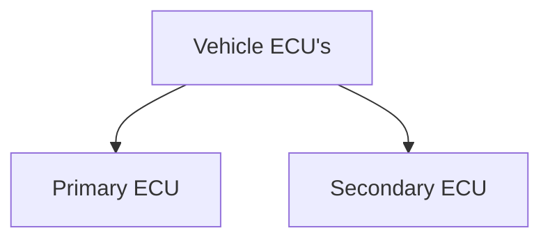
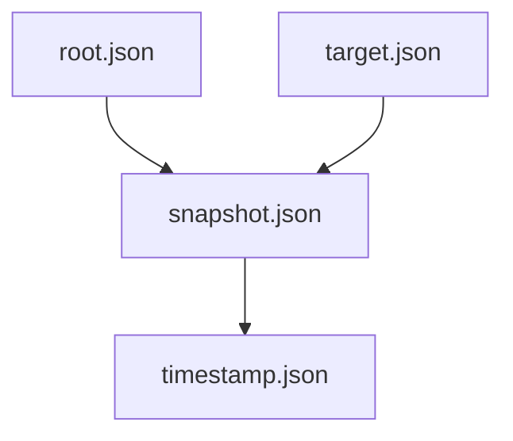
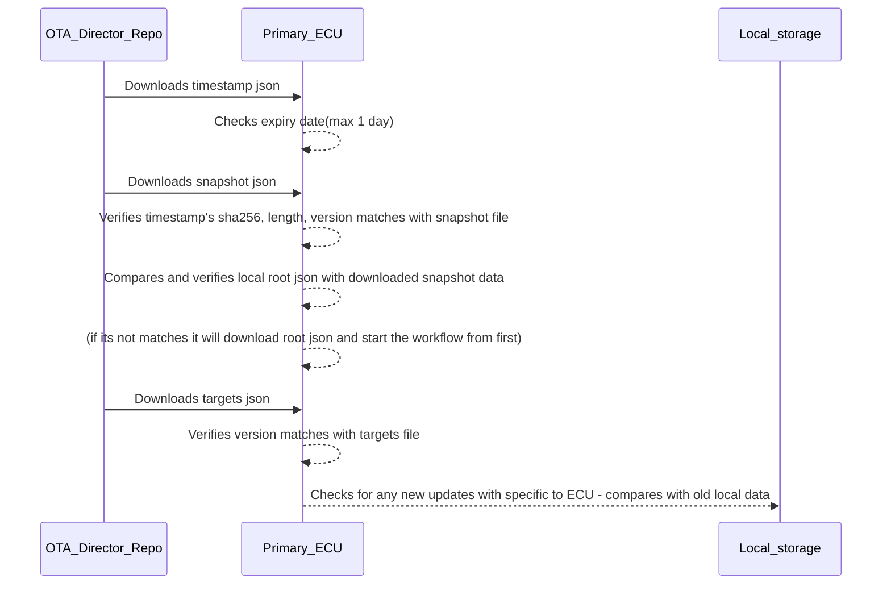
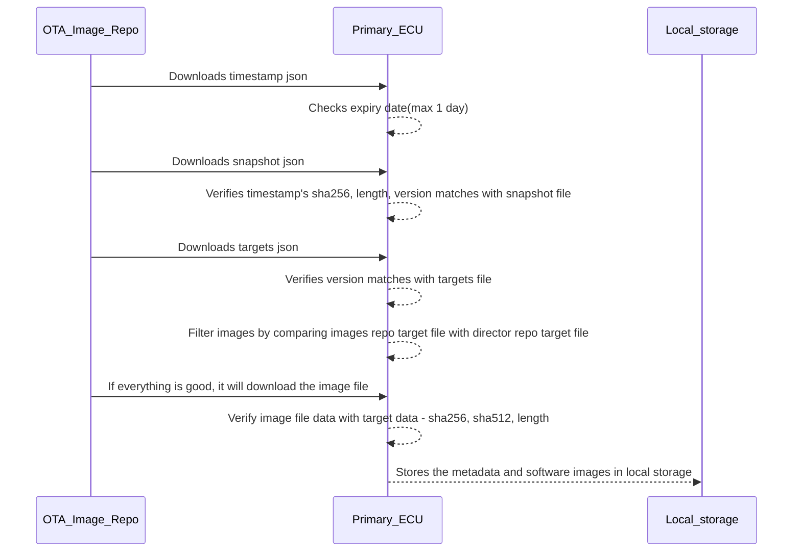
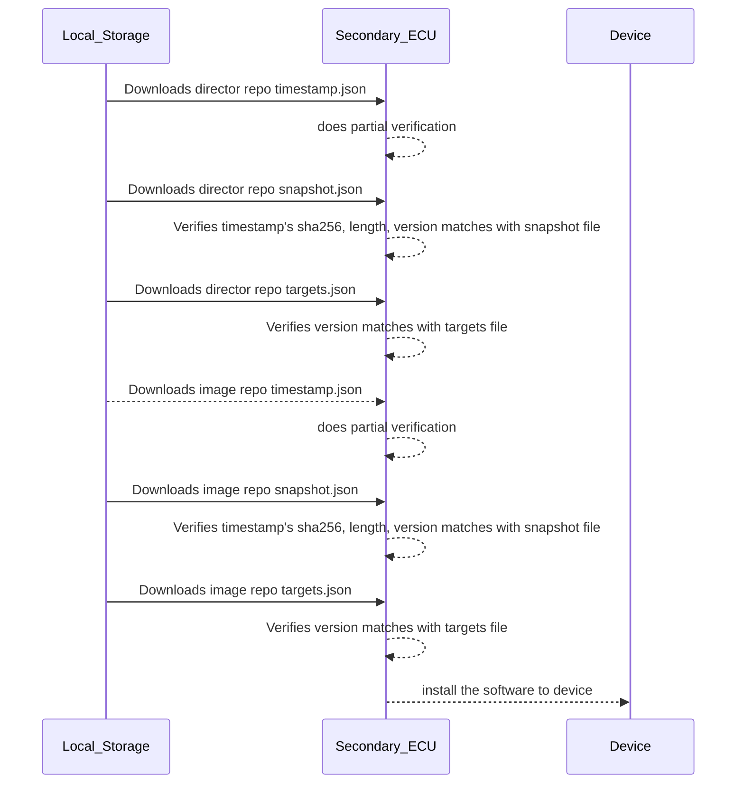
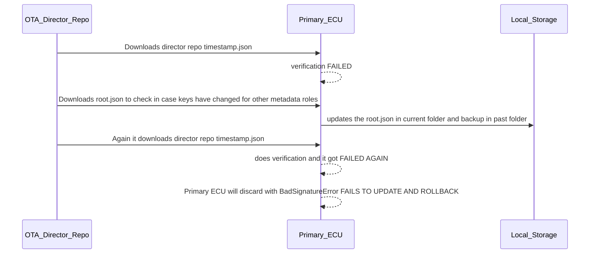
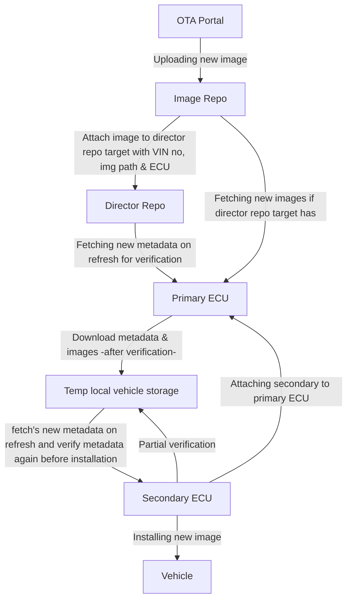

## Uptane Workflow

#### Uptane Repositories

#### Available uptane roles

#### Vehicle ECU's

#### Verification of json files

#### Primary ECU Intractions

### Intraction between Director Repo and Primary ECU on Refresh or on Check for new updates

### If no update it will discard, or if there is any new update it will fetch from image repo

### Secondary ECU intraction with local storage and device:

### workflow of fallback or failure senario:

#### Overall workflow

