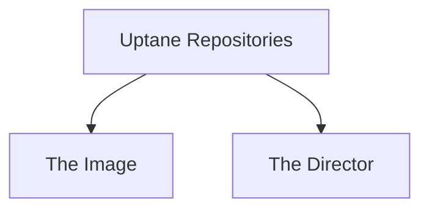
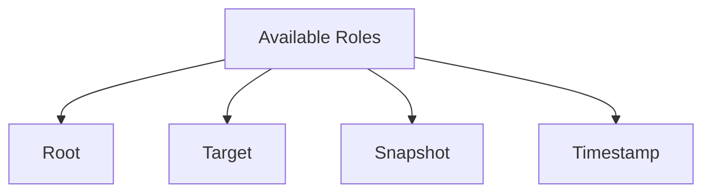
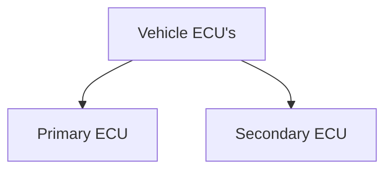
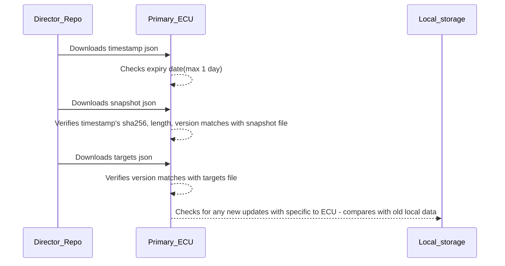
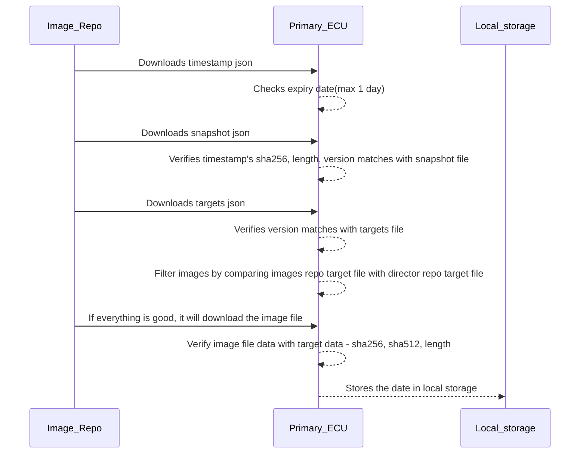
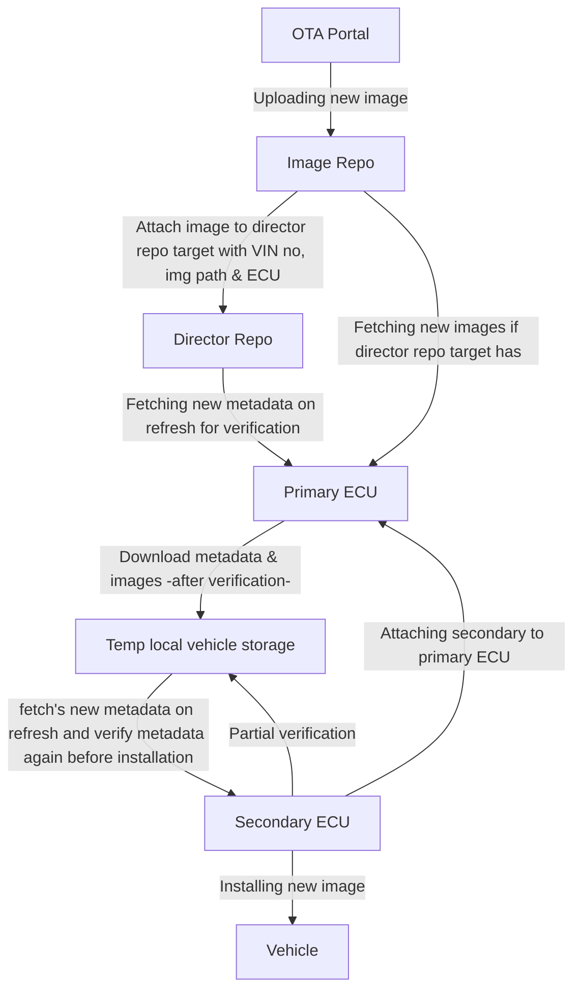

## Uptane Workflow

#### Uptane Repositories

#### Available uptane roles

#### Vehicle ECU's

#### Primary ECU Intractions

Intraction between Director Repo and Primary ECU on Refresh or on Check for new updates

If no update it will discard, or if there is any new update it will fetch from image repo

#### Overall workflow

